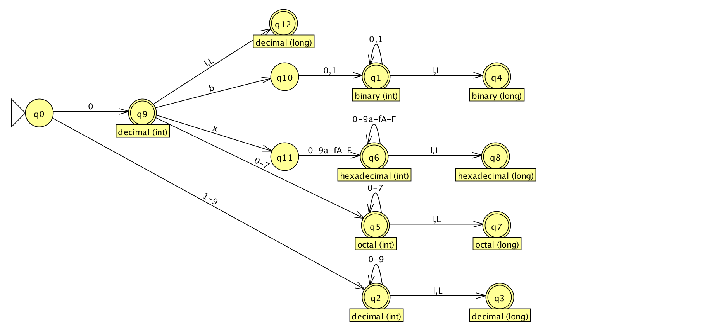

Question 2
----------

1.

| literal | int | long |
|---------|-----|------|
| binary  | `/0b[0-1]+/` | `/0b[0-1]+(l|L)/` |
| octal   | `/0[0-7]+/` | `/0[0-7]+(l|L)/` |
| hexadecimal | `/0x[0-9a-f]+/` | `/0x[0-9a-f]+(l|L)/` |
| decimal | `/(0|[1-9][0-9]*)/` | `/(0|[1-9][0-9]*(l|L))/` |

2.

